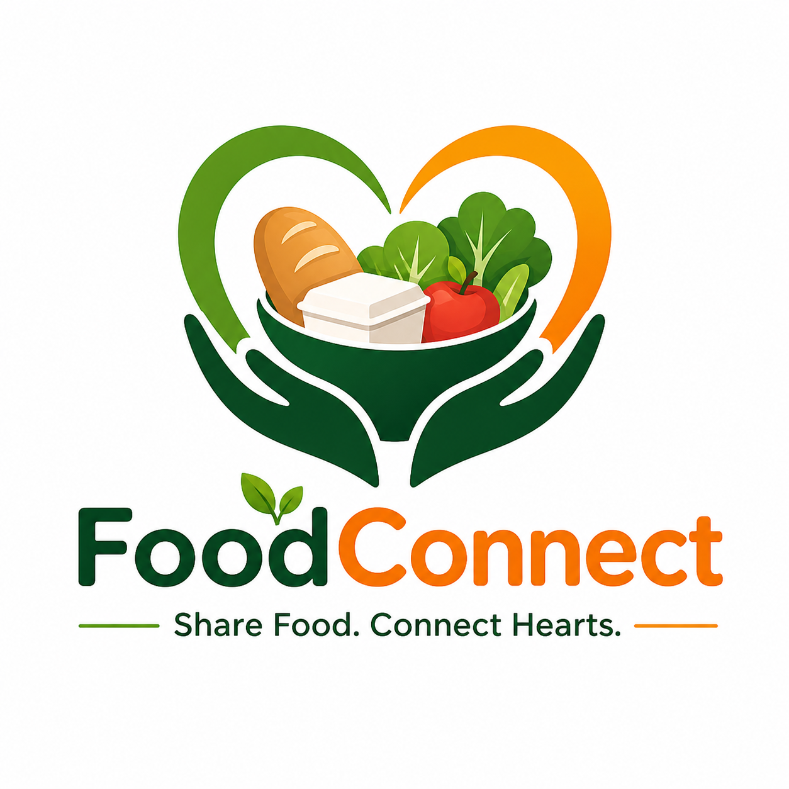

# 🍱 FoodConnect

**Share Food. Connect Hearts.**

FoodConnect is a modern web application that connects food donors with receivers, helping reduce food waste while supporting those in need.



---

## 🎨 Features

### For Doners (Food Providers)
- ✅ Create and manage food listings
- 📸 Upload food images
- 📦 Track orders and requests
- 💬 Chat with receivers
- 🔔 Receive notifications

### For Receivers
- 🔍 Browse available food
- 🛒 Place orders
- 💬 Chat with doners
- 📊 Track order status

---

## 🚀 Tech Stack

| Layer | Technology |
|-------|------------|
| Frontend | React 18 |
| Backend | FastAPI (Python) |
| Database | SQLite |
| Authentication | JWT + bcrypt |
| Image Storage | Local server storage |

---

## 📁 Project Structure

```
FoodConnect/
├── backend/
│   ├── database/
│   │   └── database.py         # Database connection
│   ├── models/
│   │   └── models.py           # SQLAlchemy models
│   ├── schemas/
│   │   └── schemas.py          # Pydantic schemas
│   ├── routers/
│   │   ├── auth.py             # Authentication routes
│   │   ├── food.py             # Food CRUD routes
│   │   ├── orders.py           # Order management
│   │   ├── chat.py             # Messaging
│   │   └── notifications.py    # Notifications
│   ├── services/
│   │   └── auth.py             # JWT & password utils
│   ├── uploads/                # Image storage
│   ├── main.py                 # FastAPI app
│   └── requirements.txt
│
├── frontend/
│   ├── public/
│   │   └── index.html
│   ├── src/
│   │   ├── components/
│   │   │   └── common/         # Reusable components
│   │   ├── pages/              # Page components
│   │   ├── context/            # Auth context
│   │   ├── services/           # API services
│   │   └── styles/             # Global styles
│   └── package.json
│
└── README.md
```

---

## 🛠️ Installation & Setup

### Prerequisites
- Python 3.9+
- Node.js 16+
- npm or yarn

### 1️⃣ Backend Setup

```bash
# Navigate to backend folder
cd backend

# Create virtual environment
python -m venv venv

# Activate virtual environment
# On Windows:
venv\Scripts\activate
# On macOS/Linux:
source venv/bin/activate

# Install dependencies
pip install -r requirements.txt
```

### 2️⃣ Frontend Setup

```bash
# Navigate to frontend folder
cd frontend

# Install dependencies
npm install
```

---

## 🏃 Running the Application

### Start Backend Server

```bash
cd backend

# Activate virtual environment (if not already active)
# Windows:
venv\Scripts\activate

# Start the server (binds to 0.0.0.0 for LAN access)
python main.py
```

Or using uvicorn directly:
```bash
uvicorn main:app --host 0.0.0.0 --port 8000 --reload
```

The backend will be available at:
- Local: `http://localhost:8000`
- LAN: `http://<your-ip>:8000`
- API Docs: `http://localhost:8000/docs`

### Start Frontend Development Server

```bash
cd frontend

# Start React development server
npm start
```

The frontend will be available at:
- Local: `http://localhost:3000`
- LAN: `http://<your-ip>:3000`

---

## 🌐 LAN Access

To access from other devices on the same network:

1. Find your computer's IP address:
   ```bash
   # Windows
   ipconfig
   
   # macOS/Linux
   ifconfig
   ```

2. Access the app:
   - Frontend: `http://<your-ip>:3000`
   - Backend API: `http://<your-ip>:8000`

---

## 📱 API Endpoints

### Authentication
| Method | Endpoint | Description |
|--------|----------|-------------|
| POST | `/auth/register` | Register new user |
| POST | `/auth/login` | Login user |
| GET | `/auth/me` | Get current user |

### Food Items
| Method | Endpoint | Description |
|--------|----------|-------------|
| GET | `/food` | List all food items |
| POST | `/food` | Create food listing |
| GET | `/food/{id}` | Get food details |
| PUT | `/food/{id}` | Update food item |
| DELETE | `/food/{id}` | Delete food item |
| GET | `/food/search` | Search food items |
| GET | `/food/my-listings` | Get user's listings |

### Orders
| Method | Endpoint | Description |
|--------|----------|-------------|
| GET | `/orders` | List orders |
| POST | `/orders` | Create order |
| PUT | `/orders/{id}` | Update order status |
| GET | `/orders/stats/summary` | Get order statistics |

### Chat
| Method | Endpoint | Description |
|--------|----------|-------------|
| GET | `/chat/conversations` | List conversations |
| GET | `/chat/order/{id}` | Get messages for order |
| POST | `/chat` | Send message |

### Notifications
| Method | Endpoint | Description |
|--------|----------|-------------|
| GET | `/notifications` | List notifications |
| GET | `/notifications/unread-count` | Get unread count |
| PUT | `/notifications/{id}/read` | Mark as read |

---

## 🎨 Design System

### Colors
| Color | Hex | Usage |
|-------|-----|-------|
| Primary | `#2E7D32` | Main actions, branding |
| Accent | `#FF8F00` | Highlights, CTAs |
| Background | `#F9F9F9` | Page background |
| Success | `#10B981` | Success states |
| Warning | `#F59E0B` | Warning states |
| Error | `#EF4444` | Error states |

### Typography
- Font: Inter
- Weights: 400, 500, 600, 700

### Spacing
- Base unit: 8px
- Scale: 4, 8, 12, 16, 20, 24, 32, 40, 48, 64

---

## 📝 Environment Variables

### Backend
Create a `.env` file in the backend folder (optional):
```env
SECRET_KEY=your-secret-key-here
```

### Frontend
The frontend automatically detects the backend URL from the current hostname.

---

## 🧪 Testing

### Test User Accounts

After starting the app, create test accounts:

1. **Doner Account**
   - Role: Doner
   - Can create food listings and manage orders

2. **Receiver Account**
   - Role: Receiver
   - Can browse food and place orders

---

## 📜 License

MIT License

---

## 👨‍💻 Contributing

1. Fork the repository
2. Create a feature branch
3. Commit your changes
4. Push to the branch
5. Open a Pull Request

---

**Made with ❤️ for a better world**
